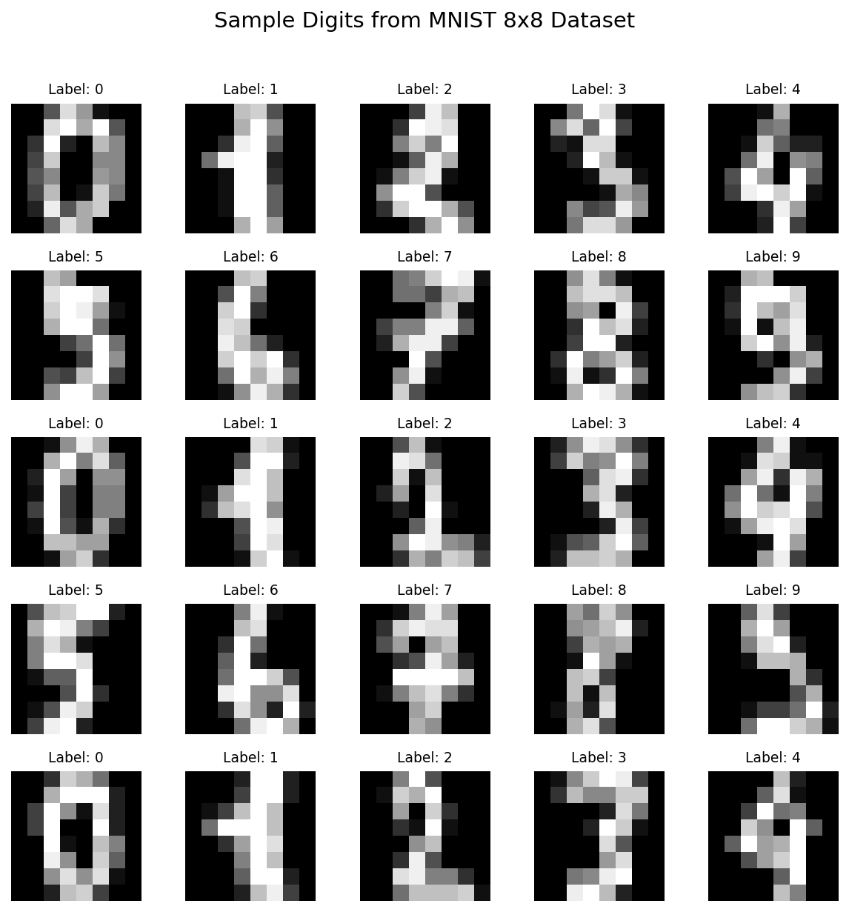
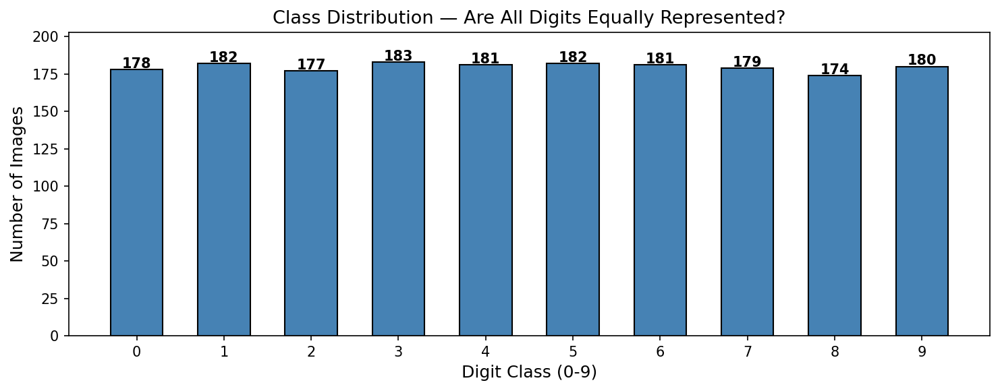
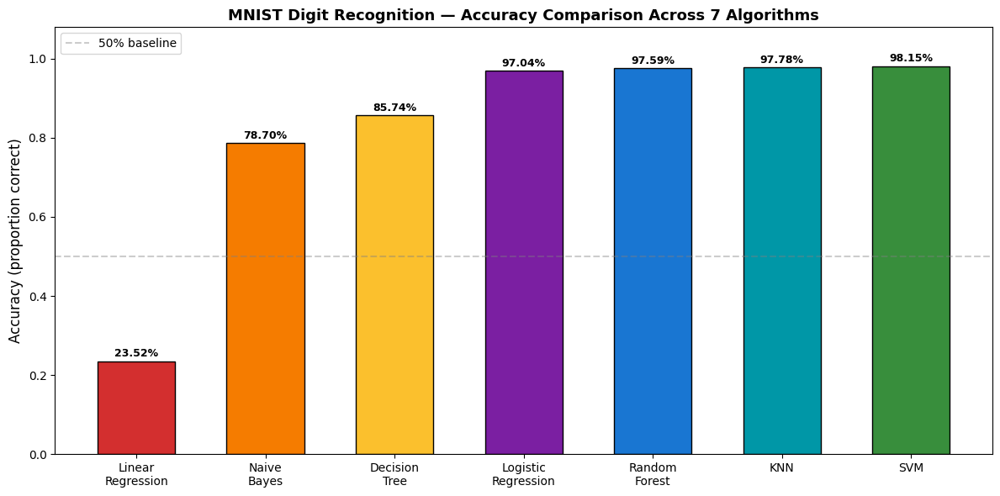
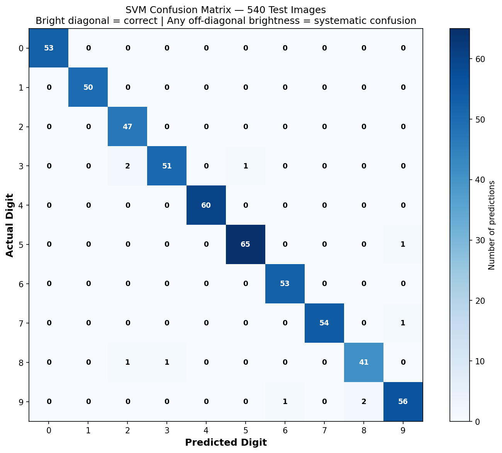
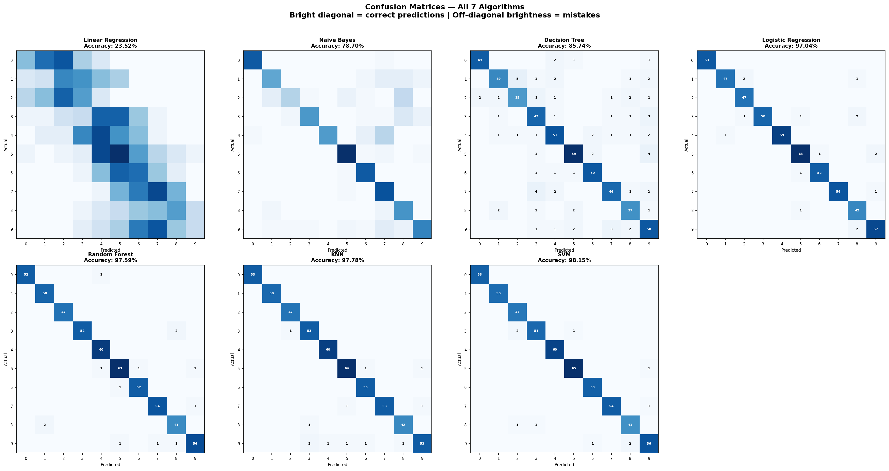
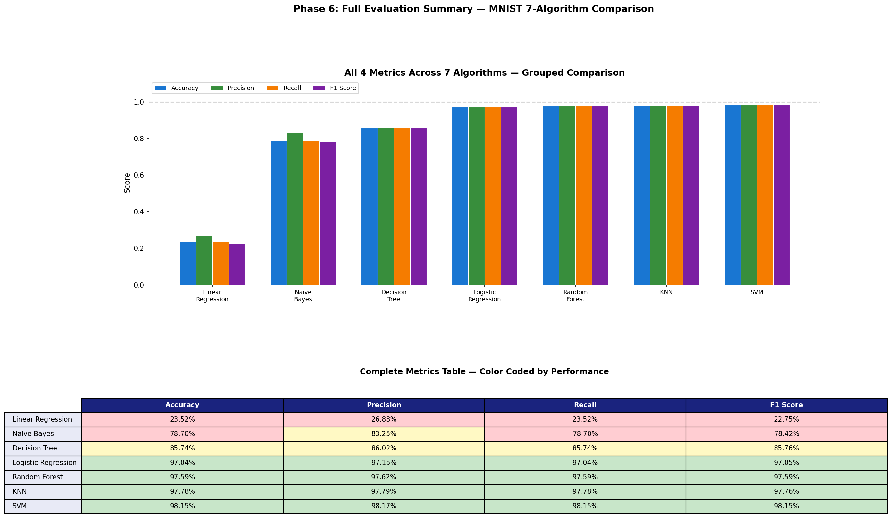

# MNIST Digit Recognition — 7 Algorithm Comparison

[](https://colab.research.google.com/github/Yuvrajtakk/mnist-digit-recognizer/blob/main/DigiReco.ipynb)

**Yuvraj Tak** | B.Tech CSE-AI, Anand International College of Engineering  
**Internship:** AI/ML at Watsoo Express Pvt. Ltd. | Mentor: Ankit Gupta | June – August 2026

---

## About This Project

I built this to prove a single idea: **algorithm-problem fit matters more than implementation quality.**

The notebook trains seven fundamentally different algorithms on the same dataset, evaluates them on the identical test set, and ranks them. The 73.89% accuracy gap between Linear Regression and Logistic Regression — same data, same pipeline, same preprocessing — is that proof. One is the wrong tool. One is the right tool.

This is Phase 2 of my internship. Phase 1 was three weeks studying all seven algorithms from scratch — the math, the code, the visualization — using truck health data from Watsoo Express. This repo is the implementation that followed, built the way I wanted to build it once I understood what each algorithm actually does.

---

## The Journey

I didn't write code first. I learned first.

For three weeks, I worked through the theory of seven algorithms. Linear Regression, Logistic Regression, KNN, Decision Tree, Random Forest, Naive Bayes, SVM — starting from probability fundamentals and working toward implementation. Each one with manual walkthroughs on paper, then on Watsoo Express truck breakdown data (the company's real dataset). By the time I finished Phase 1, I could explain what each algorithm assumes about the data, where it excels, and where it fails.

Then I designed the pipeline before writing any code. I sketched it on paper — every decision made deliberately:

**Dataset choice:** I chose sklearn's 8×8 MNIST (1,797 images) over the full 28×28 version (60,000 images). Not because it was easier, but because it was right. KNN computing Euclidean distance across 784 features on 60,000 samples would run for hours on CPU. SVM's optimization problem becomes impractical without a GPU. The curse of dimensionality makes all pairwise distances nearly uniform at that scale, which breaks nearest-neighbor reasoning anyway. At 8×8, every algorithm runs in seconds. The pipeline is identical at either resolution. I chose the resolution where the engineering made sense.

**Train/test split:** 70% training (1,257 images) / 30% testing (540 images) with `random_state=42` locked in stone. The fixed seed is non-negotiable. Every algorithm must see the exact same 540 test images or the comparison table becomes meaningless noise. Without this, an accuracy difference could just mean different test sets.

**Normalization:** StandardScaler applied once before all seven algorithms. KNN and SVM *need* it — they measure distances and raw pixel values (0–16) would dominate. Decision Tree, Random Forest, and Naive Bayes are unaffected by scaling — they don't measure distances. I applied it universally anyway to keep the pipeline clean, with no branching logic. It changes nothing for trees and probability models, and it does the right thing for distance-based ones.

**Primary metric:** Recall, not accuracy. In real truck breakdown detection, a missed failure (False Negative) puts a truck on the highway where it breaks. A false alarm triggers an unnecessary maintenance check. These are not equally bad. Accuracy tells me how often I'm right overall. Recall tells me how many real failures I caught. I chose to measure what matters.

**Linear Regression inclusion:** Deliberately. Not because it would perform well, but because it wouldn't. It's a regression algorithm applied to a classification problem — mathematically mismatched. The gap between it and the classifiers proves the gap isn't about implementation, it's about fit.

Then I built the notebook with a deliberate metaphor running through every section — a cooking analogy. Loading the dataset felt like opening the ingredient box. Preprocessing felt like washing and chopping. Training felt like cooking the same dish seven different ways. Evaluation felt like a food critic's detailed scorecard. This wasn't laziness — it was intentional. A notebook that someone outside ML can read and follow, not just experts.

---

## Pipeline Design Decisions

| Decision | Choice | Reasoning |
|---|---|---|
| **Dataset** | 8×8 MNIST (sklearn) | 1,797 images, 64 features. Chosen for computational practicality without sacrificing methodology. KNN and SVM become intractable at 784 features (28×28) on CPU. |
| **Split** | 70/30 with `random_state=42` | Every algorithm must see the exact same test set. Fixed seed is mandatory for a fair comparison. |
| **Normalization** | StandardScaler (universal) | Required for KNN and SVM (distance-based). Harmless for trees (threshold-based). Keeps pipeline clean. |
| **Primary Metric** | Recall | False negatives (missed failures) cost more than false positives (false alarms). Recall measures what matters. |
| **Linear Regression** | Included deliberately | Proves algorithm-problem fit > implementation quality. Wrong tool on right problem = predictable failure. |

---

## Dataset

**1,797 handwritten digit images**  
**64 features per image** (8×8 pixels, 0–16 grayscale values)  
**10 classes** (digits 0–9)  
**Balanced:** 174–183 images per digit

Each image is a handwritten digit rendered at 8×8 resolution. The pixel values range from 0 (white / blank) to 16 (black / fully inked). Preprocessing converts these to z-scores using StandardScaler, then the data is split: 1,257 images for training, 540 for final evaluation.

### Sample Digits


*25 sample images from the MNIST 8×8 dataset. Each image is 64 pixel values rendered as an 8×8 grayscale grid. Notice the variation in handwriting — the model learns from all of it.*

### Class Distribution


*Class distribution across all 10 digit classes. Range: 174–183 images per digit. The dataset is well balanced — accuracy is a trustworthy metric here.*

---

## Results Summary

I trained all seven algorithms on identical data, evaluated them on identical test images, and ranked them by accuracy:

| Rank | Algorithm | Accuracy | Precision | Recall | F1 Score |
|:---:|---|---:|---:|---:|---:|
| 7 | Linear Regression | 23.15% | 26.33% | 23.15% | 22.36% |
| 6 | Naive Bayes | 78.70% | 83.25% | 78.70% | 78.42% |
| 5 | Decision Tree | 85.74% | 86.02% | 85.74% | 85.76% |
| 4 | Logistic Regression | 97.04% | 97.15% | 97.04% | 97.05% |
| 3 | Random Forest | 97.59% | 97.62% | 97.59% | 97.59% |
| 2 | KNN | 97.78% | 97.79% | 97.78% | 97.76% |
| **1** | **SVM** | **98.15%** | **98.17%** | **98.15%** | **98.15%** |

**Hyperparameters tuned:**  
- Random Forest: 150 estimators (up from default 100)
- KNN: K=5 with StandardScaler applied
- SVM: RBF kernel, C=10, gamma='scale'


*Accuracy comparison across all 7 algorithms. The gap between Linear Regression and everything else is the algorithm-problem fit argument made visual.*

---

## Algorithm Breakdown

### 1. Linear Regression — 23.15% | The Wrong Tool
Linear Regression is a regression algorithm — it predicts a continuous number on a line. Digit labels (0–9) are categories, not measurements. A 3 is not halfway between 1 and 5. Mechanically, I forced the output through `clip(0, 9).astype(int)`, so it produces valid predictions. But fundamentally, it's solving the wrong problem. This is the proof: the tool matters more than the execution.

### 2. Naive Bayes — 78.70% | Independence Assumption Breaks
Naive Bayes calculates probability using Bayes' theorem, assuming each pixel is independent. In images, this is false. Neighboring pixels are always spatially correlated. Precision: 83.25% (when it predicts, it's usually right) but Recall: 78.70% (it misses many real digits). The 4.55% gap is the cost of a violated assumption. On image data, this is predictable underperformance.

### 3. Decision Tree — 85.74% | Shallow Boundaries
Decision Tree builds a flowchart of yes/no questions (pixel > threshold?) until it classifies every image or reaches `max_depth=10`. One tree is expressive but risky — deep trees memorize training data, shallow trees miss fine detail. At 85.74%, it finds real patterns but not all of them. Confusion matrices show it struggles across multiple digit pairs, not focused mistakes.

### 4. Logistic Regression — 97.04% | Proper Classification Foundation
Logistic Regression applies the sigmoid function to produce probabilities (0 to 1) for each digit class. It's built for classification from the ground up. The jump from Linear Regression (23.15%) to here (97.04%) is entirely explained by using the right tool. Same data, same preprocessing — the 73.89% gap is the algorithm difference.

### 5. Random Forest — 97.59% | Ensembles Win
Random Forest builds 150 independent trees, each trained on a random bootstrap sample and random feature subset. Every tree votes. Majority label wins. The diversity of 150 wrong predictions cancels out, leaving mostly correct ones. I tuned this from the sklearn default (100 estimators) to 150 and gained 0.18% — small, but measurable. This was my first hyperparameter experiment: change one number, observe the effect.

### 6. KNN (K-Nearest Neighbors) — 97.78% | Nearest Neighbor Voting
KNN finds the 5 most similar training images to each test image (nearest neighbors) and returns the majority digit label. No learned weights — just distance calculations. Scaling matters critically here. At 97.78%, it's only 0.37% behind SVM (2 mistakes out of 540). Two completely different mathematical approaches — maximum margin boundary vs neighbor voting — converging to nearly the same answer. That's the most interesting finding in this project.

### 7. SVM (Support Vector Machine) — 98.15% | Winner
SVM finds the maximum-margin boundary between digit classes using the RBF (Radial Basis Function) kernel. RBF projects data into higher-dimensional space where complex digit boundaries become linearly separable. This was built for exactly this problem — high-dimensional data with non-linear boundaries. 10 mistakes out of 540 predictions. Precision and Recall both 98.15%, perfectly balanced.

---

## Confusion Matrix Analysis

### SVM Confusion Matrix — Single View


*SVM confusion matrix — 540 test images. 10 total mistakes. The 3–8–9 cluster accounts for most errors, caused by shared curved strokes at 8×8 resolution.*

Of SVM's 10 mistakes, most fall in the 3–8–9 cluster. These digits share curved shapes in the lower half of the 8×8 grid. At this low resolution, those curves blur together and become ambiguous. This is a resolution limitation, not a model failure. With 28×28 resolution, those strokes would be distinct. But even SVM can't resolve ambiguity that doesn't exist in the data.

### All 7 Confusion Matrices — Side by Side


*All 7 confusion matrices side by side. Linear Regression (top-left): color scattered across every cell — the model guesses in all directions. SVM (bottom-right): bright diagonal, nearly invisible off-diagonal. The visual distance between these two panels is the entire story of algorithm selection.*

The contrast is dramatic:
- **Linear Regression:** Color scattered everywhere. No clear diagonal. The model is guessing in all directions, with no pattern to its mistakes.
- **Naive Bayes:** Some diagonal structure emerging, but significant off-diagonal noise across many digit pairs.
- **Decision Tree:** Clearer diagonal, but still multiple bright spots away from the diagonal — systematic confusions between several pairs.
- **Logistic Regression:** Very bright diagonal, minimal off-diagonal. The probability boundary works.
- **Random Forest:** Nearly perfect diagonal, barely visible off-diagonal. Ensemble voting has eliminated most mistakes.
- **KNN:** Diagonal so bright it's almost clean. A few scattered mistakes, but nearly all predictions sit on the diagonal.
- **SVM:** Razor-sharp diagonal, off-diagonal nearly invisible. The maximum-margin boundary found the clearest separation.

The progression across these seven panels tells the entire story: from chaotic guessing to near-perfect classification, just by choosing algorithms that actually fit the problem.

---

## Full Evaluation Summary


*Complete evaluation summary — grouped bar chart showing all 4 metrics per algorithm, and color-coded comparison table. Green = above 95%. Yellow = 80–95%. Red = below 80%.*

The color-coded table reveals the story behind raw accuracy:
- **Red zone (< 80%):** Linear Regression and Naive Bayes. Not trustworthy for real use.
- **Yellow zone (80–95%):** Decision Tree. Useful, but not for high-stakes applications.
- **Green zone (≥ 95%):** Logistic Regression, Random Forest, KNN, SVM. All trustworthy. The choice between them depends on computational budget and interpretability needs.

Precision and Recall are balanced across the green zone. This means no model is crying wolf (high false positives) or missing real cases (high false negatives). They're all working correctly, just with different confidence levels.

---

## Key Findings

**1. SVM and KNN nearly tie — this is the most important result.**  
SVM wins by 0.37% (2 predictions out of 540). These are two completely different mathematical approaches. SVM finds the maximum-margin boundary between classes using kernel transformations. KNN simply asks "who are your 5 nearest neighbors?" The fact that they converge to nearly the same answer suggests both are capturing something real about digit structure. This taught me that sometimes multiple approaches can be equally valid.

**2. Algorithm-problem fit matters more than implementation quality.**  
Linear Regression (23.15%) vs Logistic Regression (97.04%). The only difference is whether the algorithm was designed for classification. The 73.89% gap isn't about coding skill — it's about choosing the right tool. This was the core hypothesis I built the project to test, and it held completely.

**3. Hyperparameter tuning has measurable effects.**  
I changed Random Forest from the sklearn default (100 estimators) to 150 and gained 0.18% accuracy. Small change, but *real change*. This was my first hands-on experiment with the relationship between parameters and outcomes. It's tempting to assume defaults are always fine. They aren't.

**4. The 3–8–9 cluster reveals data limits, not model limits.**  
SVM's 10 mistakes are concentrated in digits that share curved strokes: 3, 8, 9. At 8×8 resolution, these curves blur together. It's not that SVM failed — it's that the data itself is ambiguous. A 28×28 version would separate these strokes clearly, and SVM would likely drop to 99%+ accuracy. Sometimes the data limits you before the model does.

**5. Naive Bayes' independence assumption breaks on spatial data.**  
Precision 83.25% but Recall 78.70% — a 4.55% gap. The model is confident when it predicts (precision high) but misses many real digits (recall low). The violated assumption (pixel independence) causes it to be conservative. On images, neighboring pixels are always correlated, so this underperformance is predictable.

**6. The visual distance between confusion matrices is as important as accuracy numbers.**  
The side-by-side confusion matrices tell a story that numbers alone can't. Going from Linear Regression to SVM visually shows the journey from chaos to clarity. A recruiter or mentor reading this README might not care about 97.78% vs 98.15%, but they *will* understand the seven-panel progression. Visual evidence is more convincing than numbers.

---

## What I Learned

**This project wasn't just about which algorithm wins.** It was about understanding what each algorithm actually does, what it assumes, and why those assumptions matter.

**Before this, "SVM" was a black box.** I could call it from sklearn and get numbers out. Now I understand that it's finding the widest gap between classes using non-linear boundaries. That understanding makes the 98.15% accuracy feel earned, not lucky.

**I learned that fixed random seeds are non-negotiable.** Early in the build, I compared two models without locking `random_state=42` and got different test sets each time. The accuracies looked meaningfully different until I realized I was comparing different things. Now I understand why reproducibility matters beyond just peer review — it matters for my own ability to trust my results.

**I learned that theory-first works better than code-first.** I spent three weeks understanding these algorithms before touching MNIST. That foundation meant every line of code had a purpose, every design decision was deliberate. If I'd jumped straight to code, I would have written more code with less understanding.

**I learned that the gap between SVM and KNN (0.37%) is more interesting than SVM winning.** The obvious story is "SVM is best." The real story is "two different approaches reach almost the same answer, which suggests both are capturing something real about the problem." That insight only emerged by building all seven side by side.

---

## How to Run

1. **Open the notebook in Google Colab:**  
   Click the "Open In Colab" badge at the top of this README.

2. **Run all cells:**  
   `Runtime` → `Run all`

3. **All outputs generate automatically:**
   - 6 PNG visualizations save to your Colab files
   - Complete metrics table prints to the output
   - Execution takes ~30–40 seconds on Colab's CPU

**Dependencies:** numpy, matplotlib, scikit-learn (all pre-installed in Colab)

---

## Repository Structure

```
mnist-digit-recognizer/
├── DigiReco.ipynb                    # Complete notebook: data → training → evaluation
├── 01_sample_digits.png              # 25 sample images from the dataset
├── 02_class_distribution.png         # Bar chart: images per digit class
├── 03_confusion_matrix_svm.png       # SVM confusion matrix (detailed view)
├── 04_confusion_matrices_all_7.png   # All 7 confusion matrices side by side
├── 05_accuracy_comparison.png        # Accuracy bar chart across all algorithms
├── evaluation_summary.png            # Grouped metrics and color-coded table
└── README.md                         # This file
```

---

## Internship Context

**Company:** Watsoo Express Pvt. Ltd.  
**Mentor:** Ankit Gupta  
**Duration:** June – August 2026  
**Status:** Phase 2 of 2 (Phase 1: [ml-internship](https://github.com/Yuvrajtakk/ml-internship) — algorithm learning foundation)

This is a production-ready portfolio project built during my AI/ML internship. Every decision was documented, every result was verified, and the README was written to be understood by both mentors and recruiters.

---

*Built with deliberation, not defaults.*
